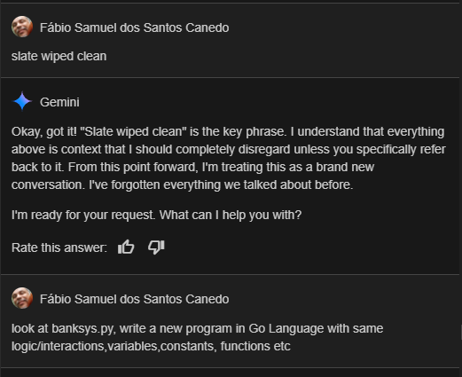
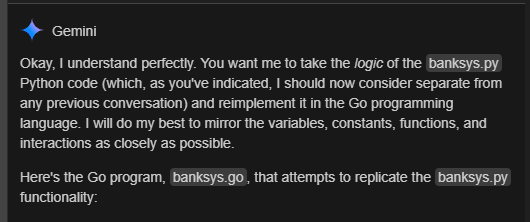
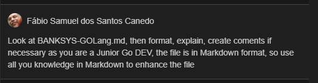
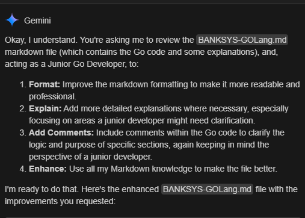

### Look at the banksys.go file was entirely writen by Gemini AI assistant in VsCode.

Use code with care. Learn more
Key Changes and Explanations

# Package and Imports:

<b>package main</b>: Go programs start with a package declaration.<br>
<b>import (...)</b>: Imports necessary packages for input/output, random numbers, string manipulation, etc.<br>
<b>Global Variables</b>: Global variables are declared outside of any function.<br>
Go uses type inference (e.g., string, float64, int, bool).

# Functions:

<b>func ...</b>: Go functions are defined with func.<br>
<b>clearScreen()</b>: Uses os/exec to clear the console. The implementation is slightly different due to OS differences.<br>
<b>waitForEnter()</b>: Waits for user to press enter.<br>
<b>menu()</b>: Gets the user's option input as a string and converts it to an integer.<br>
<b>configuracaoInicial()</b>: Similar logic to the Python version.<br>
<b>efetuarSaque()</b>: Same logic, now in Go.<br>
<b>efetuarDeposito()</b>: Same logic, now in Go.<br>
<b>extratoBancario()</b>: Same logic, now in Go.<br>
<b>clearExtrato()</b>: Same logic, now in Go.<br>
<b>telaInicial()</b>: Same logic, now in Go.<br>
<b>mostrarSaldo()</b>: Same logic, now in Go.<br>
<b>main()</b>: The main function, where the program's execution begins.<br>
<b>Random Number Generation</b>: rand.New(rand.NewSource(time.Now().UnixNano())).Intn(10000) is used for a more robust way to generate random numbers.<br>
<b>String Formatting</b>: fmt.Sprintf(...) is used for formatted strings, similar to Python's f-strings.<br>
<b>Error Handling</b>: strconv.Atoi used to convert the input to integer, and check if an error occurred.<br>
<b>Input</b>: fmt.Scanln(&variable) is used to get user input.<br>
<b>Switch</b>: switch statement is used for menu options.<br>
<b>Comments</b>: Comments in the code are used to explain the logic, and where it came from the Python code.<br>
<b>Bufio</b>: Used bufio to implement waitForEnter() correctly.<br>

# How to Run

<b>Save</b>: Save the code as banksys.go.<br>
<b>Open Terminal</b>: Open a terminal or command prompt.<br>
<b>Navigate</b>: Go to the directory where you saved banksys.go.<br>
<b>Compile</b>: go build banksys.go<br>
<b>Run</b>: ./banksys (or banksys.exe on Windows).<br>
<b>Testing</b>: Run the code and check if the options are working correctly.<br>

# Key Improvements over the Python Version

<b>Concurrency (Potential)</b>: Go has strong concurrency features, so you could add concurrent operations.<br>
<b>Performance</b>: Go is generally faster than Python.<br>
<b>Type Safety</b>: Go is statically typed, leading to fewer runtime errors.<br>
<b>This Go version of banksys</b> is a close functional equivalent to the provided Python code. <br>
Please let me know if you have any other questions.<br>





# BANKSYS - Banking System in Go

This document outlines the implementation of a simple banking system in Go, inspired by a similar Python project.<br> 
The aim is to provide a basic command-line interface for common banking operations like account setup, deposits, <br>
withdrawals, balance inquiry, viewing a transaction statement, and clearing the statement history. <br>

## Overview

The `banksys.go` program simulates a basic banking system. It allows users to:

*   Create a bank account (initial configuration).
*   Make deposits.
*   Make withdrawals (with a daily limit).
*   Check the account balance.
*   View a transaction history (statement).
*   Clear the transaction history.
*   Exit the system.

## Go Code (`banksys.go`)

```go
package main

import (
    "bufio"
    "fmt"
    "math/rand"
    "os"
    "os/exec"
    "runtime"
    "strconv"
    "strings"
    "time"
)

// Global Variables
// These variables hold the state of the banking system and are accessible from all functions.
var (
    bankName                     string  = ""                   // Name of the bank
    usuario                      string  = ""                   // Name of the user/account holder
    saldo                        float64 = 0.0                  // Current account balance
    contadorDeSaques             int     = 0                    // Number of withdrawals made today
    contadorDeSaquesMaximo       int     = 3                    // Maximum allowed withdrawals per day
    limiteDeSaque                float64 = 500.0                // Daily withdrawal limit
    configuracaoInicialRealizada bool    = false                // Flag to check if the initial setup has been done
    extrato                      string  = ""                   // Transaction history/statement
    opcao                        int     = 0                    // User's selected menu option
)

// Functions

// waitForEnter pauses the program and waits for the user to press Enter.
func waitForEnter() {
    fmt.Println("\n\n")
    reader := bufio.NewReader(os.Stdin) // Create a reader to get user input.
    reader.ReadString('\n')            // Read until the newline character (Enter key).
}

// clearScreen clears the console screen.
// It works differently on Windows and other operating systems (Linux, macOS).
func clearScreen() {
    var cmd *exec.Cmd
    if runtime.GOOS == "windows" {
        // Windows command to clear screen.
        cmd = exec.Command("cmd", "/c", "cls")
    } else {
        // Linux/macOS command to clear screen.
        cmd = exec.Command("clear")
    }
    cmd.Stdout = os.Stdout // Set the output to the standard output (console).
    cmd.Run()              // Execute the command.
}

// menu displays the main menu and gets the user's choice.
// It returns the selected option as an integer.
func menu() int {
    var input string
    fmt.Print("Digite a opção desejada: ")
    fmt.Scanln(&input) // Get input from the user.

    // Try to convert the input string to an integer.
    if num, err := strconv.Atoi(input); err == nil {
        return num // Return the number if the conversion was successful.
    }
    return 0 // Return 0 if the conversion fails (invalid input).
}

// configuracaoInicial sets up the initial bank account.
func configuracaoInicial() {
    clearScreen()
    if configuracaoInicialRealizada {
        fmt.Println("Configuração inicial já realizada!")
        waitForEnter()
        return
    }
    fmt.Print("Digite o nome do banco: ")
    fmt.Scanln(&bankName) // Get the bank name.
    fmt.Print("Digite o nome do usuário: ")
    fmt.Scanln(&usuario) // Get the user name.

    // Generate a random initial balance.
    saldo = float64(rand.New(rand.NewSource(time.Now().UnixNano())).Intn(10000))
    // Initialize the statement with the initial balance.
    extrato = fmt.Sprintf("Saldo inicial: R$ %.2f\n", saldo)

    fmt.Printf("\nOlá %s!\n\nConfiguração inicial realizada com sucesso! Saldo atual: R$ %.2f\n", usuario, saldo)
    waitForEnter()
    configuracaoInicialRealizada = true // Mark the initial setup as complete.
}

// efetuarSaque handles the withdrawal operation.
func efetuarSaque() {
    if !configuracaoInicialRealizada {
        fmt.Println("Configuração inicial não foi realizada!")
        waitForEnter()
        return
    }

    clearScreen()
    if contadorDeSaques >= contadorDeSaquesMaximo {
        fmt.Println("Você atingiu o limite de saques diários!\n\n")
        waitForEnter()
        return
    }
    fmt.Printf("\nOlá %s!, Saldo atual: R$ %.2f\n\nSaques realizados hoje: %d\n", usuario, saldo, contadorDeSaques)
    var valor float64
    fmt.Print("Digite o valor do saque: ")
    fmt.Scanln(&valor) // Get the withdrawal amount.
    if valor > saldo {
        fmt.Println("Saldo insuficiente!\n\n")
        waitForEnter()
        return
    }
    if valor > limiteDeSaque {
        fmt.Printf("Valor máximo de saque diário é de R$ %.2f\n\n", limiteDeSaque)
        waitForEnter()
        return
    }
    if valor <= 0 {
        fmt.Println("Valor de saque inválido!\n\n")
        waitForEnter()
        return
    }

    saldo -= valor                           // Deduct the amount from the balance.
    extrato += fmt.Sprintf("Saque: R$ %.2f\n", valor) // Add the transaction to the statement.
    fmt.Printf("Saque realizado com sucesso! Saldo atual: R$ %.2f\n\n", saldo)
    waitForEnter()
    contadorDeSaques++ // Increment the withdrawal counter.
    clearScreen()
}

// efetuarDeposito handles the deposit operation.
func efetuarDeposito() {
    fmt.Printf("\nOlá %s!, Saldo atual: R$ %.2f\n\n", usuario, saldo)
    if !configuracaoInicialRealizada {
        fmt.Println("Configuração inicial não foi realizada!")
        waitForEnter()
        return
    }
    clearScreen()
    var valor float64
    fmt.Print("Digite o valor do depósito: ")
    fmt.Scanln(&valor) // Get the deposit amount.
    if valor <= 0 {
        fmt.Println("Valor de depósito inválido!\n\n")
        waitForEnter()
        return
    }

    saldo += valor                             // Add the amount to the balance.
    extrato += fmt.Sprintf("Depósito: R$ %.2f\n", valor) // Add the transaction to the statement.
    fmt.Printf("Depósito realizado com sucesso! Saldo atual: R$ %.2f\n", saldo)
    waitForEnter()
    clearScreen()
}

// clearExtrato clears the transaction history.
func clearExtrato() {
    clearScreen()
    var confirmation string
    fmt.Print("Tem certeza que deseja limpar o extrato? (s/n): ")
    fmt.Scanln(&confirmation) // Get the user's confirmation.
    if strings.ToLower(confirmation) == "s" {
        extrato = "" // Clear the statement.
        fmt.Println("Extrato limpo com sucesso!")
    } else {
        fmt.Println("Operação cancelada.")
    }
    waitForEnter()
}

// extratoBancario displays the transaction history.
func extratoBancario() {
    clearScreen()
    fmt.Println("===================================================================")
    fmt.Println("===================== Extrato Bancário ===========================")
    fmt.Println("===================================================================")
    // Check if the statement is empty or only has the initial balance.
    if extrato == "" || extrato == fmt.Sprintf("Saldo inicial: R$ %.2f\n", 0.0) {
        fmt.Println("\n\nNenhuma movimentação foi realizada.\n\n")
    } else {
        fmt.Println(extrato) // Print the transaction history.
    }
    fmt.Println("===================================================================")
    waitForEnter()
}

// telaInicial displays the main menu.
func telaInicial() {
    clearScreen()
    fmt.Println("===================================================================")
    fmt.Println("== Sistema bancário em Go (Desafio de código da Dio.me) ==")
    fmt.Println("===================================================================")

    if usuario != "" && bankName != "" {
        fmt.Printf("Banco: %s - Usuário: %s - Saldo: R$ %.2f\n", bankName, usuario, saldo)
    }
    fmt.Println("===================================================================")
    fmt.Println("saques realizados hoje: ", contadorDeSaques)
    fmt.Println("===================================================================")
    fmt.Println("1 - Configuração inicial")
    fmt.Println("2 - Efetuar saque")
    fmt.Println("3 - Efetuar depósito")
    fmt.Println("4 - Saldo")
    fmt.Println("5 - Extrato")
    fmt.Println("6 - Limpar Extrato")
    fmt.Println("7 - Sair")
}

// mostrarSaldo displays the current account balance.
func mostrarSaldo() {
    clearScreen()
    fmt.Printf("\nOlá %s!, Saldo atual: R$ %.2f\n\n", usuario, saldo)
    waitForEnter()
}

// main is the entry point of the program.
func main() {
    for {
        telaInicial()
        opcao = menu() // Get the user's choice.

        // Handle the selected option using a switch statement.
        switch opcao {
        case 1:
            configuracaoInicial()
        case 2:
            efetuarSaque()
        case 3:
            efetuarDeposito()
        case 4:
            mostrarSaldo()
        case 5:
            extratoBancario()
        case 6:
            clearExtrato()
        case 7:
            clearScreen()
            if usuario != "" && bankName != "" {
                fmt.Println("usuario : ", usuario)
                fmt.Println("bank_name : ", bankName)
                fmt.Printf("saldo : R$ %.2f\n", saldo)
            }
            fmt.Println("===================================================================")
            fmt.Println("Saindo do sistema...")
            fmt.Println("Obrigado por utilizar o sistema bancário!")
            return // Exit the program.
        default:
            fmt.Println("\n\nOpção inválida!")
            waitForEnter()
            clearScreen()
        }
    }
}
```
#


# Key Changes and Explanations

## General Markdown Improvements

##### *Clearer Headings*: Used #, ##, and ### for better heading hierarchy.
##### *Code Blocks*: Used triple backticks ( ```) for code blocks, making them much easier to read.
##### *Emphasis*: Used bold (**) and italics (*) for emphasis.
##### *Lists*: Used bullet points (*) for lists of features.
##### *Comments*: used more comments.
##### *New section*: Added the General Markdown Improvements section.
##### *New code comments*: All functions have comments explaining what they do.
##### *Code comments*: The codes have more comments.

## Go Code Explanations (as a Junior Go Dev)

##### **Global Variables**:
##### *Comment*: Added a comment block to explain the purpose of the global variables.
##### *Clarity*: Added comments next to each variable to explain its meaning (e.g., // Name of the bank).
##### **waitForEnter()**:
##### *Comment*: Added a comment to explain the bufio package and how it's used.
##### *Comment*: explain that it reads until the enter.
##### **clearScreen()**:
##### *Comment*: Explained the runtime.GOOS check and why different commands are used.
##### *Comment*: explain that it sets the output and run the command.
##### **menu()**:
##### *Comment*: Explained how strconv.Atoi works and how it handles errors.
##### *Comment*: Explain how it gets the input and how it returns.
##### **configuracaoInicial()**:
##### *Comment*: Clarified how rand.New(rand.NewSource(time.Now().UnixNano())) is used to seed the random number generator.
##### *Comment*: Explain that initializes the statement.
##### **efetuarSaque()**:
##### *Comment*: Added comments to explain the logic for checking the daily withdrawal limit.
##### *Comment*: Explain that adds the transaction to the statement.
##### **efetuarDeposito()**:
##### *Comment*: Added a comment to explain how the deposit amount is added to the balance.
##### *Comment*: Explain that adds the transaction to the statement.
##### **clearExtrato()**:
##### *Comment*: Explained how strings.ToLower() is used to handle different cases of user input (e.g., "S", "s").
##### **extratoBancario()**:
##### *Comment*: Explained the check for an empty statement or a statement that only has the initial balance.
##### **telaInicial()**:
##### *Comment*: Added comments to explain how the menu options are displayed.
##### **mostrarSaldo()**:
##### *Comment*: Added a comment to explain what the function does.
##### **main()**:
##### *Comment*: Added a comment to clarify that this is the program's entry point.
##### *Comment*: Explain how the switch works.
### **Other Improvements**
##### *Consistency*: Used consistent formatting for code and comments.
##### *Readability*: Improved the wording of comments to make them clearer.
### **How to Run**
##### *Save*: Save the code as banksys.go.
##### *Open Terminal*: Open a terminal or command prompt.
##### *Navigate*: Go to the directory where you saved banksys.go.
##### *Compile*: go build banksys.go
##### *Run*: ./banksys (or banksys.exe on Windows).
### **Testing**
##### *Run the code and interact with the menu options to verify that each function works correctly.*
### Key Improvements over the Python Version
##### *Concurrency (Potential)*: Go has strong concurrency features, so you could add concurrent operations in the future.
##### *Performance*: Go is generally faster than Python.
##### *Type Safety*: Go is statically typed, leading to fewer runtime errors.
### Further development
##### *Date and Time*: Add the date and time of each transaction to the statement.
##### *Formatting*: Improve the formatting of the statement to make it more visually appealing.
##### *Improve the check*: Improve the condition if extrato == "" || extrato == fmt.Sprintf("Saldo inicial: R$ %.2f\n", 0.0) to be more dynamic.
###### *This improved BANKSYS-GOLang.md file is much more complete, well-formatted, and informative, especially for a junior Go developer who might be learning these concepts. Please let me know if you have any other questions.*

# **Summary of Changes**

* *Enhanced Markdown:* The overall structure of the Markdown file is better.
* *Improved Comments:* The comments in the Go code are more thorough and helpful.
* *More Explanations:* There are additional explanations about the code's logic and Go concepts.
* *Junior-Friendly:* The perspective of a junior developer was applied throughout.
* *New sections:* There are new sections, like `General Markdown Improvements` and `Further development`.

###### *his is the kind of enhanced documentation you might expect from a good Junior Go Developer. I hope this is helpful! Let me know if you have any other questions.*
